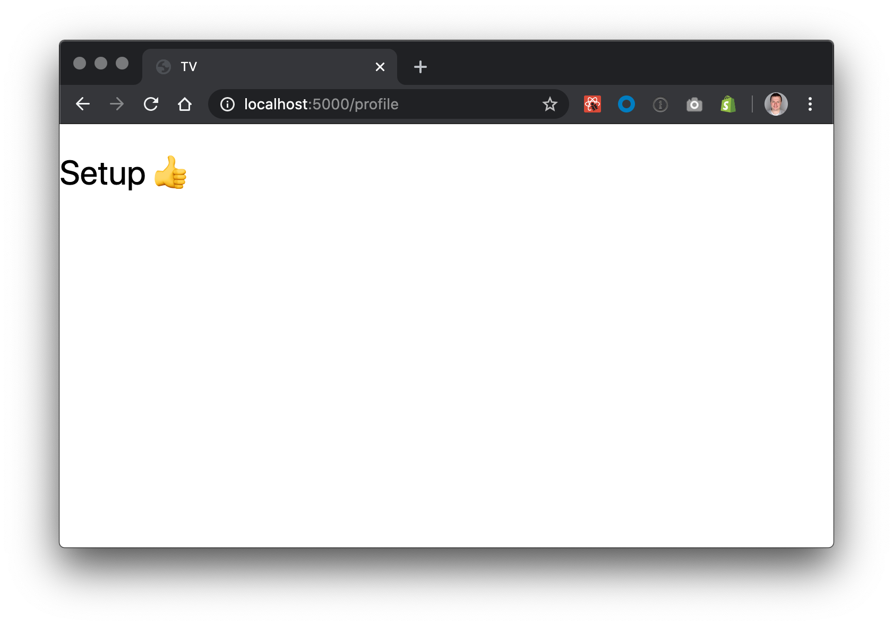

# concat-tv

> The .concat() IPTV service

## What it does

* Parse M3U playlists and extracts channels from it
* Automatically check and mark channels if up/down
* Custom playlist management and export
* Collaborative editing

## Getting started

### Mac/Linux

```bash
./bin/up
./bin/start
```

### Windows (PowerShell)

Follow instructions in [./bin/up.ps1](./bin/up.ps1).

```pwsh
./bin/up.ps1
rails db:drop
rails db:create
rails db:structure:load
rails db:migrate
./bin/start.ps1
```

#### Known Windows problems

The gem `foreman` which is installed by the `./bin/up.ps1` script has a known issue with Windows, where the process somethimes can't be terminated in PowerShell. You have to terminate the Ruby and Node processes (or the whole PowerShell) manually in the TaskManager.

#### Additional setup for Docker Toolbox Users (Windows 10 Home)

Look for every `localhost` in the database config files (`.env`, `cable.yml` and `database.yml`) and replace it with the IP address of the docker-machine (e.g. `192.168.99.100`). You can find this IP address with following command: 

```
docker-machine ip
```

### Result

Open [http://localhost:5000](http://localhost:5000). You should see this:



## Mandatory

* [Ruby 2.6.6](https://www.ruby-lang.org/en/)
* [Docker](https://www.docker.com/products/docker-desktop) and docker-compose
* [Homebrew](https://brew.sh/)
* [PostgreSQL](https://www.postgresql.org/)

## Recommended

* [Postico](https://eggerapps.at/postico/) (MAC only) or similar database GUIs (e.g. [DataGrip](https://www.jetbrains.com/datagrip) (all platforms) free for students)
* Evergreen browser (Chrome, Firefox, …)
